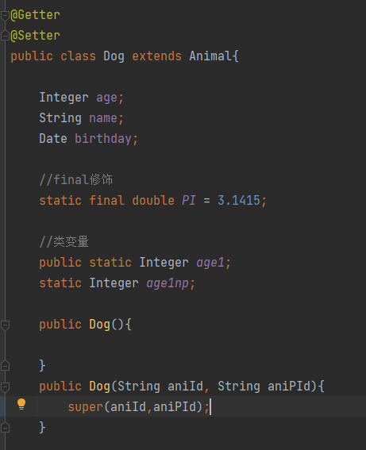
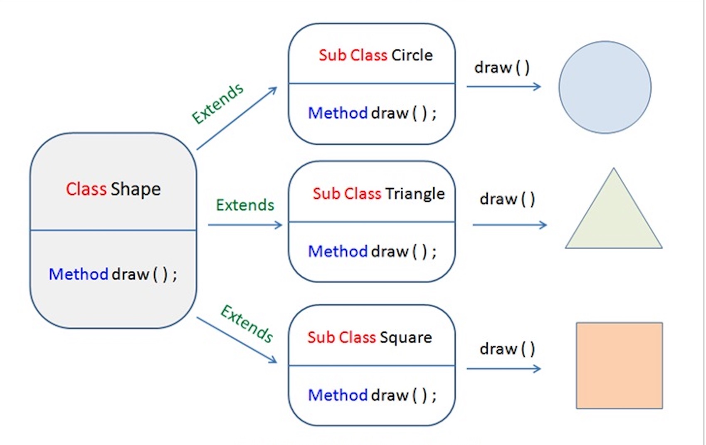
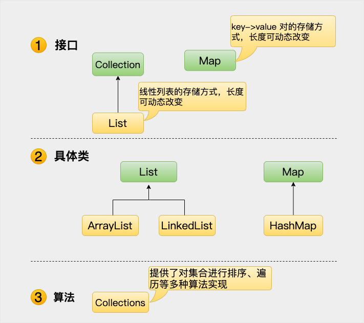

# Java 基础

## Java 基础语法

https://www.runoob.com/java/java-basic-syntax.html

### 一、基本语法

1.**大小写敏感**

2.**类名命名规范**

3.**方法名命名规范**

4.**主方法入口**

### 二、Java 标识符

标识符：类名、变量名以及方法名

### 三、Java修饰符

- 访问控制修饰符 : default, public , protected, private

  **private**：表示私有的,表示类访问权限.<font color="#dd0000">只能在本类中访问</font>,离开本类之后,就不能直接访问.<font color="#dd0000">加了private的方法或变量不能通过类名.的方法访问</font>

  **default**：不写(缺省)(void):表示包私有,表示<font color="#dd0000">包访问权限</font>. 访问者的包必须和当前定义类的包相同才能访问.(两个类在同一个包下)

  **protected**：被protected修饰的成员对于<font color="#dd0000">本包和其子类</font>(extends)可见

  **public**：表示全局的,可以<font color="#dd0000">公共访问</font>权限,如某个字段/方法,使用了public修饰,则可以在当前项目中任何地方访问
  

- 非访问控制修饰符 : final, abstract, static, synchronized

  **static** 修饰符，用来修饰类方法和类变量
  **final** 修饰符，用来修饰类、方法和变量，final 修饰的类不能够被继承，修饰的方法不能被继承类重新定义，修饰的变量为常量，是不可修改的。<font color="#dd0000">初始化得赋值声明</font>

  ```java
  public final String finalId = "AnimalId";  //初始化得赋值声明
  ```

  **abstract** 修饰符，用来创建抽象类和抽象方法。抽象类不能用来实例化对象，声明抽象类的**唯一目的**是为了<font color="#dd0000">将来对该类进行扩充</font>。

  一个类不能同时被 abstract 和 final 修饰。如果一个类包含抽象方法，那么该类一定要声明为抽象类，否则将出现编译错误。
  
  抽象类可以包含抽象方法和非抽象方法。
  
  **synchronized** 和 **volatile** 修饰符，主要用于线程的编程。synchronized 关键字声明的方法同一时间只能被一个线程访问。(*注：transient 修饰符修饰的变量不进行序列化*)

### 四、Java 变量

- **局部变量**：**对象生成(new)时才会有**。在方法、构造方法或者语句块中定义的变量被称为局部变量。变量声明和初始化都是在方法中，<font color="#dd0000">方法结束后，变量就会自动销毁</font>。

- **类变量**（静态变量）:**类加载时就会有**。类变量也声明在类中，方法体之外，但必须声明为 <font color="#dd0000">static 类型</font>。

- **成员变量**（非静态变量）：成员变量是<font color="#dd0000">定义在类中，方法体之外的变量</font>。**这种变量在创建对象的时候实例化**。成员变量可以被类中方法、构造方法和特定类的语句块访问

  ```java
  public class Hero {
  
  	int age;//成员变量
  	String name;//成员变量
  
  	static int age1;//类变量（静态变量）不加public默认表示包权限
  	static String name2;//类变量（静态变量）不加public默认表示包权限
  
  	public void run(){
  		String name3;//局部变量
  		int age3;//局部变量
  
  	}
  
  }
  ```

  

### 五、Java 数组

### 六、Java 枚举

**Java 5.0**引入了枚举，枚举限制变量只能是预先设定好的值。使用枚举可以减少代码中的 bug。

### 七、Java 关键字

Java 关键字。这些保留字不能用于常量、变量、和任何标识符的名称(详情见链接https://www.runoob.com/java/java-basic-syntax.html)

### 八、Java注释

支持**单行注释**和**多行注释**

```java
public class HelloWorld {
   /* 这是第一个Java程序
    * 它将输出 Hello World
    * 这是一个多行注释的示例
    * IDEA快捷键：Ctrl+Shift+/
    */
    public static void main(String[] args){
       // 这是单行注释的示例  IDEA快捷键：Ctrl+/
       /* 这个也是单行注释的示例 */
       System.out.println("Hello World"); 
    }
}
```

### 九、继承(extends)

在 Java 中，一个类可以由其他类派生。如果你要创建一个类，而且已经存在一个类具有你所需要的属性或方法，那么你可以将新创建的类继承该类。

利用继承的方法，可以<font color="#dd0000">重用已存在类的方法和字段属性</font>，而不用重写这些代码。被继承的类称为**超类（super class）**，派生类称为**子类（sub class)**

**父类中声明为 private 的方法，不能够被子类继承**

### 十、接口(interface)

在 Java 中，接口可理解为<font color="#dd0000">对象间相互通信的协议</font>。接口在继承中扮演着很重要的角色。

接口只定义派生要用到的方法，但是方法的具体实现完全取决于派生类。

## Java 对象和类

https://www.runoob.com/java/java-object-classes.html

### 一、Java中的对象

拿一条狗来举例，它的状态有：名字、品种、颜色，行为有：叫、摇尾巴和跑。

对比**现实对象**和**软件对象**，它们之间十分<font color="#dd0000">相似</font>。

软件对象也有状态和行为。软件对象的**状态就是属性**，**行为通过方法体现**。

在软件开发中，*方法操作对象内部状态的改变，对象的相互调用也是通过方法来完成*

### 二、Java 中的类

类可以看成是<font color="#dd0000">创建 Java 对象的模板</font>

### 三、构造方法

每个类都有构造方法。如果没有显式地为类定义构造方法，Java 编译器将会为该类提供一个默认构造方法（无参）。

- 当写了一个有参构造方法，默认的无参构造就会失效，需要显式写一个无参构造方法，(@NoArgsConstructor)无参构造方法就会生效

```java
public class Puppy{
    public Puppy(){    //无参构造方法
    }
 
    public Puppy(String name){   //有参构造方法
        // 这个构造器仅有一个参数：name
    }
}
```

### 四、匿名类

```java
package study.dto;

import lombok.*;

import java.util.Date;

/**
 * @author: Ray
 * @date: 2023年06月30日 16:58
 */

@Getter
@Setter
@AllArgsConstructor
@NoArgsConstructor
public class Dog extends Animal{

    Integer age;
    String name;
    Date birthday;

    public void housekeeping(){
        System.out.println("我会看家");
    }

    //匿名内部类
    public static class AnonymousInnerDog{
        public static void main(String[] args) {
            Dog dog = new Dog(){
                @Override
                public void housekeeping() {
                    System.out.println("我会匿名看家");
                }
            };
            dog.housekeeping();
        }
    }

}
```

## Java 基本数据类型

https://www.runoob.com/java/java-basic-datatypes.html

### 一、内置数据类型

Java语言提供了八种基本类型。六种数字类型（四个整数型，两个浮点型），一种字符类型，还有一种布尔型。Byte、Short、Integer、Long、Float、Double、Character、Boolean

```java
基本类型：byte 二进制位数：8
包装类：java.lang.Byte
最小值：Byte.MIN_VALUE=-128
最大值：Byte.MAX_VALUE=127

基本类型：short 二进制位数：16
包装类：java.lang.Short
最小值：Short.MIN_VALUE=-32768
最大值：Short.MAX_VALUE=32767

基本类型：int 二进制位数：32
包装类：java.lang.Integer
最小值：Integer.MIN_VALUE=-2147483648
最大值：Integer.MAX_VALUE=2147483647

基本类型：long 二进制位数：64
包装类：java.lang.Long
最小值：Long.MIN_VALUE=-9223372036854775808
最大值：Long.MAX_VALUE=9223372036854775807

基本类型：float 二进制位数：32
包装类：java.lang.Float
最小值：Float.MIN_VALUE=1.4E-45
最大值：Float.MAX_VALUE=3.4028235E38

基本类型：double 二进制位数：64
包装类：java.lang.Double
最小值：Double.MIN_VALUE=4.9E-324
最大值：Double.MAX_VALUE=1.7976931348623157E308

基本类型：char 二进制位数：16
包装类：java.lang.Character
最小值：Character.MIN_VALUE=0
最大值：Character.MAX_VALUE=65535

基本类型：boolean 二进制位数：1
包装类：java.lang.Boolean
```

### 二、引用类型

- 引用类型指向一个对象，指向对象的变量是引用变量。这些变量在声明时被指定为一个特定的类型，比如 Employee、Puppy 等。变量一旦声明后，类型就不能被改变了。
- 对象、数组都是引用数据类型。

- 所有引用类型的默认值都是null。

- 一个引用变量可以用来引用任何与之兼容的类型。 例：

  ```java
  Map<String,Object> map = new HashMap<String,Object>;  //引用变量map
  ```

### 三、Java 常量

常量在程序运行时是**不能被修改**的。

在 Java 中使用 **<font color="#dd0000">final 关键字</font>**来修饰常量，声明方式和变量类似：

```java
final double PI = 3.1415927;  //变量名用大写(规范)
```

### 四、自动类型转换

```java
低  ------------------------------------>  高

byte,short,char—> int —> long—> float —> double 
```

数据类型转换必须满足如下规则：

- 不能对boolean类型进行类型转换。
- 不能把对象类型转换成不相关类的对象。
- 在把容量大的类型转换为容量小的类型时必须使用强制类型转换。
- 转换过程中可能导致溢出或损失精度
- **自动类型转换**：short数据类型的位数为16位，就可以自动转换位数为32的int类型
- 浮点数到整数的转换是通过舍弃小数得到，而不是四舍五入，例如：

```java
(int)23.7 == 23;  
```

<font color="#dd0000">包装类不能强转哦</font>，要用对应包装类的方法转换：

```java
Float value = 10.1f;
Integer value1 = value.intValue();
```

## Java 运算符

https://www.runoob.com/java/java-operators.html

### 一、算术运算符(7)

| +    | 加法 - 相加运算符两侧的值         | A + B 等于 30                      |
| ---- | --------------------------------- | ---------------------------------- |
| -    | 减法 - 左操作数减去右操作数       | A – B 等于 -10                     |
| *    | 乘法 - 相乘操作符两侧的值         | A * B等于200                       |
| /    | 除法 - 左操作数除以右操作数       | B / A等于2                         |
| ％   | 取余 - 左操作数除以右操作数的余数 | B%A等于0                           |
| ++   | 自增: 操作数的值增加1             | B++ 或 ++B 等于 21（区别详见下文） |
| --   | 自减: 操作数的值减少1             | B-- 或 --B 等于 19（区别详见下文） |

### 二、关系运算符(6)

| ==   | 检查如果两个操作数的值是否相等，如果相等则条件为真。         | （A == B）为假。 |
| ---- | ------------------------------------------------------------ | :--------------- |
| !=   | 检查如果两个操作数的值是否相等，如果值不相等则条件为真。     | (A != B) 为真。  |
| >    | 检查左操作数的值是否大于右操作数的值，如果是那么条件为真。   | （A> B）为假。   |
| <    | 检查左操作数的值是否小于右操作数的值，如果是那么条件为真。   | （A <B）为真。   |
| >=   | 检查左操作数的值是否大于或等于右操作数的值，如果是那么条件为真。 | （A> = B）为假。 |
| <=   | 检查左操作数的值是否小于或等于右操作数的值，如果是那么条件为真。 | （A <= B）为真。 |

### 三、位运算符(7)

| ＆   | 如果相对应位都是1，则结果为1，否则为0                        | （A＆B），得到12，即0000 1100  |
| ---- | ------------------------------------------------------------ | ------------------------------ |
| \|   | 如果相对应位都是 0，则结果为 0，否则为 1                     | （A \| B）得到61，即 0011 1101 |
| ^    | 如果相对应位值相同，则结果为0，否则为1                       | （A ^ B）得到49，即 0011 0001  |
| 〜   | 按位取反运算符翻转操作数的每一位，即0变成1，1变成0。         | （〜A）得到-61，即1100 0011    |
| <<   | 按位左移运算符。左操作数按位左移右操作数指定的位数。         | A << 2得到240，即 1111 0000    |
| >>   | 按位右移运算符。左操作数按位右移右操作数指定的位数。         | A >> 2得到15即 1111            |
| >>>  | 按位右移补零操作符。左操作数的值按右操作数指定的位数右移，移动得到的空位以零填充。 | A>>>2得到15即0000 1111         |

### 四、逻辑运算符(3)

| &&    | 称为逻辑与运算符。当且仅当两个操作数都为真，条件才为真。     | （A && B）为假。    |
| ----- | ------------------------------------------------------------ | ------------------- |
| \| \| | 称为逻辑或操作符。如果任何两个操作数任何一个为真，条件为真。 | （A \| \| B）为真。 |
| ！    | 称为逻辑非运算符。用来反转操作数的逻辑状态。如果条件为true，则逻辑非运算符将得到false。 | ！（A && B）为真。  |

### 五、赋值运算符(11)

| =       | 简单的赋值运算符，将右操作数的值赋给左侧操作数               | C = A + B将把A + B得到的值赋给C          |
| ------- | ------------------------------------------------------------ | ---------------------------------------- |
| + =     | 加和赋值操作符，它把左操作数和右操作数相加赋值给左操作数     | C + = A等价于C = C + A                   |
| - =     | 减和赋值操作符，它把左操作数和右操作数相减赋值给左操作数     | C - = A等价于C = C - A                   |
| * =     | 乘和赋值操作符，它把左操作数和右操作数相乘赋值给左操作数     | C * = A等价于C = C * A                   |
| / =     | 除和赋值操作符，它把左操作数和右操作数相除赋值给左操作数     | C / = A，C 与 A 同类型时等价于 C = C / A |
| （％）= | 取模和赋值操作符，它把左操作数和右操作数取模后赋值给左操作数 | C％= A等价于C = C％A                     |
| << =    | 左移位赋值运算符                                             | C << = 2等价于C = C << 2                 |
| >> =    | 右移位赋值运算符                                             | C >> = 2等价于C = C >> 2                 |
| ＆=     | 按位与赋值运算符                                             | C＆= 2等价于C = C＆2                     |
| ^ =     | 按位异或赋值操作符                                           | C ^ = 2等价于C = C ^ 2                   |
| \| =    | 按位或赋值操作符                                             | C \| = 2等价于C = C \| 2                 |

### 六、条件运算符（?:）

```java
// 如果 a 等于 1 成立，则设置 b 为 20，否则为 30
b = (a == 1) ? 20 : 30;
```

### 七、instanceof 运算符

该运算符用于操作对象实例，检查该对象是否是一个特定类型（类类型或接口类型）

用于多态比较多：

```java
static void show(Animal a){
    if(a instanceof Dog){
        a.eat();
    }else if(a instanceof Gorilla){
        a.eat();
    }
}
```

### 八、Java运算符优先级

## Java 循环结构、条件语句、switch case 语句

循环结构：https://www.runoob.com/java/java-loop.html

条件语句：https://www.runoob.com/java/java-if-else-switch.html

switch case 语句：https://www.runoob.com/java/java-switch-case.html

只有break;才会退出，匹配到后等break或default，没有就会继续进入下一个case，并且不论匹配结果，直接输出

```java
public class Test {
   public static void main(String args[]){
      int i = 1;
      switch(i){
         case 0:
            System.out.println("0");
         case 1:
            System.out.println("1");
         case 2:
            System.out.println("2");
         case 3:
            System.out.println("3"); break;
         default:
            System.out.println("default");
      }
   }
}
------------
1
2
3
```


## Java Number & Math 类

https://www.runoob.com/java/java-number.html


### 一、装箱与拆箱

这种由编译器特别支持的包装称为<font color="#dd0000">装箱</font>，所以当内置数据类型被当作对象使用的时候，编译器会把内置类型装箱为包装类。相似的，编译器也可以把一个对象<font color="#dd0000">拆箱</font>为内置类型

```java
public class Test{
 
   public static void main(String[] args){
      Integer x = 5;   //装箱
      x =  x + 10;  //拆箱后装箱
      System.out.println(x); 
   }
}
```

### 二、Java Math 类

https://www.runoob.com/java/java-number.html

Java 的 Math 包含了用于执行基本数学运算的属性和方法，如初等指数、对数、平方根和三角函数

```java
public class Test {  
    public static void main (String []args)  
    {  
        System.out.println("90 度的正弦值：" + Math.sin(Math.PI/2));  
        System.out.println("0度的余弦值：" + Math.cos(0));  
        System.out.println("60度的正切值：" + Math.tan(Math.PI/3));  
        System.out.println("1的反正切值： " + Math.atan(1));  
        System.out.println("π/2的角度值：" + Math.toDegrees(Math.PI/2));  
        System.out.println(Math.PI);  
    }  
}
```


### 三、Number & Math 类方法

1. Number类常用：

```java
public class Test{
public static void main(String args[]){
    			//1.valueOf() 装箱(可接受String作为参数！)
                Integer x =Integer.valueOf(9);  
    			Integer y =Integer.valueOf("10");
                //2.xxxValue() 拆箱
    			//返回 byte 原生数据类型
                System.out.println(x.byteValue());
                //返回 double 原生数据类型
                System.out.println(x.doubleValue());
                //返回 long 原生数据类型
                System.out.println(x.longValue());
    
    			
    			//3.toString()  Number转String
        		Integer x = 5;
                System.out.println(x.toString());  
                System.out.println(Integer.toString(12)); 
    			//4.parseXxx()  String转内置数据类型-->Number
				int x =Integer.parseInt("9");
        		double c = Double.parseDouble("5");
    			
        }
}
```

2. Math 类常用：

```java
public class MathTest {
    public static void main(String[] args) {
        double x = 3.6;
        double z = 3.5;
        double y = 3.4;
        System.out.println("Math.ceil(x) = " + Math.ceil(x));
        System.out.println("Math.ceil(z) = " + Math.ceil(z));
        System.out.println("Math.ceil(y) = " + Math.ceil(y));  //向上取整 ans：4

        System.out.println("Math.floor(x) = " + Math.floor(x));
        System.out.println("Math.floor(z) = " + Math.floor(z));
        System.out.println("Math.floor(y) = " + Math.floor(y));  //向下取整 ans：3

        System.out.println("Math.round(x) = " + Math.round(x));
        System.out.println("Math.round(z) = " + Math.round(z));
        System.out.println("Math.round(y) = " + Math.round(y));  //四舍五入 alg：Math.floor(x+0.5)

        System.out.println("Math.random() = " + Math.random());  //返回值:double 范围:[0.0,1.0)

        //etc
        System.out.println("new Random().nextInt(10) = " + new Random().nextInt(10));  //0~9
    }
}

-----------------------------------
Math.ceil(x) = 4.0
Math.ceil(z) = 4.0
Math.ceil(y) = 4.0
Math.floor(x) = 3.0
Math.floor(z) = 3.0
Math.floor(y) = 3.0
Math.round(x) = 4
Math.round(z) = 4
Math.round(y) = 3
Math.random() = 0.7537938749527735
new Random().nextInt(10) = 4
```

## Java Character 类

https://www.runoob.com/java/java-character.html

```java
public class CharacterTest {
    public static void main(String[] args) {
        Character num = '1';
        Character zfSmall = 'a';
        Character zfBig = 'a';
        Character space = ' ';

        System.out.println("Character.isDigit() = " + Character.isDigit(num));  //是否是一个数字字符
        System.out.println("Character.isLetter() = " + Character.isLetter(zfSmall));  //是否是一个字母字符
        System.out.println("Character.toUpperCase() = " + Character.toUpperCase(zfSmall)); //小写字符转大写字符 a --> A
        System.out.println("Character.toLowerCase() = " + Character.toLowerCase(zfBig)); //大写字符转小写字符 A --> a
        System.out.println("Character.isWhitespace() = " + Character.isWhitespace(space)); //是否是一个空白字符
    }
}

-------------------------------
Character.isDigit() = true
Character.isLetter() = true
Character.toUpperCase() = A
Character.toLowerCase() = a
Character.isWhitespace() = true  
```

## Java String 类

https://www.runoob.com/java/java-string.html

### 一、String类型创建

0.底层还是字符数组char[]

1.String 创建的字符串存储在**公共池**中，2.而 new 创建的字符串对象在**堆**上：

```java
String s1 = "Runoob";              // String 直接创建
String s2 = "Runoob";              // String 直接创建
String s3 = s1;                    // 相同引用
String s4 = new String("Runoob");   // String 对象创建
String s5 = new String("Runoob");   // String 对象创建
```


**注意:**<font color="#dd0000">String 类是不可改变的，所以你一旦创建了 String 对象，那它的值就无法改变了</font>,如下图所示


### 二、String 方法

详情请见：https://www.runoob.com/java/java-string.html

### #1、使用 **==** 和 **equals()** 比较字符串

String 中 **==** 比较引用地址是否相同，**equals()** 比较字符串的内容是否相同：

```java
String s1 = "Hello";              // String 直接创建
String s2 = "Hello";              // String 直接创建
String s3 = s1;                   // 相同引用
String s4 = new String("Hello");  // String 对象创建
String s5 = new String("Hello");  // String 对象创建
 
s1 == s1;         // true, 相同引用
s1 == s2;         // true, s1 和 s2 都在公共池中，引用相同
s1 == s3;         // true, s3 与 s1 引用相同
s1 == s4;         // false, 不同引用地址
s4 == s5;         // false, 堆中不同引用地址
 
s1.equals(s3);    // true, 相同内容
s1.equals(s4);    // true, 相同内容
s4.equals(s5);    // true, 相同内容
```

### #2、String的 substring() 方法

1.public String substring(int beginIndex, int endIndex) 

 //beginIndex = 可视为字符数组下标的开始，endIndex = beginIndex + 要查询字符串的长度

2.public String substring(int beginIndex)


## Java StringBuffer 和 StringBuilder 类

当对字符串进行修改的时候，需要使用 StringBuffer 和 StringBuilder 类。

和 String 类不同的是，StringBuffer 和 StringBuilder 类的对象能够被多次的修改，并且不产生新的未使用对象。


### 一、区别

在使用 **StringBuffer** 类时，每次都会对 StringBuffer 对象本身进行操作，而不是生成新的对象，所以如果需要对字符串进行修改推荐使用 StringBuffer，**线程相对来说安全，因为它内部每个方法都加了synchronized**。

*（如果多个线程同时访问同一个`StringBuffer`对象其中一个线程在修改该对象时，其他线程也在访问该对象，则可能会发生竞态条件。）*

**StringBuilder** 类在 Java 5 中被提出，它和 StringBuffer 之间的最大不同在于 StringBuilder 的方法不是线程安全的（不能同步访问）。

由于 StringBuilder 相较于 StringBuffer **有速度优势**，所以多数情况下建议使用 StringBuilder 类。

### 二、操作方法

https://www.runoob.com/java/java-stringbuffer.html

## Java 数组

### 一、声明数组变量

<font color="#dd0000">初始化后默认元素都是0</font>

```java
double[] myList = new double[10];         // 首选的方法，初始化后默认元素都是0
double[] myList = {1,2,3,...,x};    
或
double myList[] = new double[10];         //效果相同，但不是首选方法
double myList[] = {1,2,3,...,x};
```

### 二、常用方法

java.util.Arrays 类能方便地操作数组，**它提供的所有方法都是静态**的。

例：

- 给数组赋值：通过 fill 方法。
- 对数组排序：通过 sort 方法,按升序。
- 比较数组：通过 equals 方法比较数组中元素值是否相等。
- 查找数组元素：通过 binarySearch 方法能对排序好的数组进行二分查找法操作。

## Java 日期时间

https://www.runoob.com/java/java-date-time.html

### 一、日期比较

Java使用以下三种方法来比较两个日期：

- 使用 **getTime()** 方法获取两个日期（自1970年1月1日经历的毫秒数值），然后比较这两个值。
- 使用方法 **before()，after() 和 equals()**。例如，一个月的12号比18号早，则 new Date(99, 2, 12).before(new Date (99, 2, 18)) 返回true。
- 使用 **compareTo()** 方法，它是由 Comparable 接口定义的，Date 类实现了这个接口。

### 二、使用 SimpleDateFormat 格式化日期

```java
//使用 SimpleDateFormat 格式化日期
        SimpleDateFormat simpleDateFormat = new SimpleDateFormat("yyyy-MM-dd HH:mm:ss");
        //1.date --> String
        System.out.println("simpleDateFormat.format(d) = " + simpleDateFormat.format(d));
        try {
            //2.String --> date
            System.out.println("simpleDateFormat.parse() = " + simpleDateFormat.parse("2023-05-13 09:53:23"));
        } catch (ParseException e) {
            System.out.println("抛出异常后。。。");
            throw new RuntimeException(e);
        }
```

### 三、Java 休眠(sleep)

```java
        try {
            Thread.sleep(1000*3);   //休眠3秒
        } catch (InterruptedException e) {
            throw new RuntimeException(e);
        }
```

### 四、Calendar类

**特点：**

1.能设置和**获取日期数据的特定部分**呢，比如说小时，日，或者分钟

2.在日期的这些部分**加上或者减去值**

3.Calendar类的功能要比Date类强大很多，而且在实现方式上也比Date类要复杂一些。

4.Calendar类是一个抽象类

```java
//创建一个代表系统当前日期的Calendar对象
Calendar c = Calendar.getInstance();//默认是当前日期

//设置日期为2023年5月13日
c.set(2023, Calendar.MAY,13);

//set只设定某个字段，其他年、日等同理
c.set(Calendar.MONTH,Calendar.FEBRUARY); //将月份设置为2月

//Add设置
c.add(Calendar.DATE, 20);  //日期加上20天，其他的所有数值会被重新计算

//Calendar类对象信息的获得
Calendar c1 = Calendar.getInstance();
// 获得年份
int year = c1.get(Calendar.YEAR);
// 获得月份
int month = c1.get(Calendar.MONTH) + 1;
// 获得日期
int date = c1.get(Calendar.DATE);
// 获得小时
int hour = c1.get(Calendar.HOUR_OF_DAY);
// 获得分钟
int minute = c1.get(Calendar.MINUTE);
// 获得秒
int second = c1.get(Calendar.SECOND);
// 获得星期几（注意（这个与Date类是不同的）：1代表星期日、2代表星期1、3代表星期二，以此类推）
int day = c1.get(Calendar.DAY_OF_WEEK); //1-7 --> 星期日-星期六
```

### 五、GregorianCalendar类

Calendar类实现了公历日历，GregorianCalendar是Calendar类的一个具体实现。

## Java 正则表达式

https://www.runoob.com/java/java-regular-expressions.html

java.util.regex 包主要包括以下三个类：

- **Pattern 类**：

  pattern 对象是一个**正则表达式的编译表示**。Pattern 类没有公共构造方法。要创建一个 Pattern 对象，你必须首先调用其公共静态编译方法，它返回一个 Pattern 对象。该方法接受一个正则表达式作为它的第一个参数。

- **Matcher 类**：

  Matcher 对象是**对输入字符串进行解释和匹配操作的引擎**。与Pattern 类一样，Matcher 也没有公共构造方法。你需要调用 Pattern 对象的 matcher 方法来获得一个 Matcher 对象。

- **PatternSyntaxException**：

  PatternSyntaxException 是一个非强制异常类，它表示一个正则表达式模式中的语法错误。

## Java 方法

https://www.runoob.com/java/java-methods.html


### 一、可变参数

```java
public static void main(String[] args) {
    int[] brr = {1,3,5,7};
    print(2,4,6,8,10);  //可变参数
}

public static void print(int...arr){  //可变参数,表示同一类型的多个参数，可认为自动封装为一个数组
    for (int i = 0; i < arr.length; i++) {
        System.out.println("arr[" + i + "] = " + arr[i]);
    }
}
```

### 二、finalize() 方法

Java 允许定义这样的方法，它在对象被垃圾收集器析构(回收)之前调用，这个方法叫做 finalize( )，它用来清除回收对象。

在 finalize() 方法里，你必须指定在对象销毁时候要执行的操作。

**例子：**

```java
public class FinalizationDemo {  
  public static void main(String[] args) {  
    Cake c1 = new Cake(1);  
    Cake c2 = new Cake(2);  
    Cake c3 = new Cake(3);  
      
    c2 = c3 = null;  
    System.gc(); //调用Java垃圾收集器
  }  
}  
 
class Cake extends Object {  
  private int id;  
  public Cake(int id) {  
    this.id = id;  
    System.out.println("Cake Object " + id + "is created");  
  }  
    
  protected void finalize() throws java.lang.Throwable {  
    super.finalize();  
    System.out.println("Cake Object " + id + "is disposed");  
  }  
}
-------------------------
Cake Object 1is created
Cake Object 2is created
Cake Object 3is created
Cake Object 3is disposed
Cake Object 2is disposed
```

## Java 流(Stream)、文件(File)和IO

Java.io 包几乎包含了所有操作输入、输出需要的类。所有这些流类代表了输入源和输出目标

### 一、读取控制台输入

**从控制台读取多字符输入：**

```java
//使用 BufferedReader 在控制台读取字符
 
import java.io.*;
 
public class BRRead {
    public static void main(String[] args) throws IOException {
        char c;
        // 使用 System.in 创建 BufferedReader
        BufferedReader br = new BufferedReader(new InputStreamReader(System.in));
        System.out.println("输入字符, 按下 'q' 键退出。");
        // 读取字符
        do {
            c = (char) br.read();
            System.out.println(c);
        } while (c != 'q');
    }
}
```

**从控制台读取字符串：**

```java
//从控制台读取字符串：
String str;
BufferedReader br = new BufferedReader(new InputStreamReader(System.in));
try {
    System.out.println("输入字符，按下\"end\"键退出");
    //读取字符串
    do {
        str = br.readLine();
        System.out.println(str);
    }while (!"end".equals(str));
} catch (IOException e) {
    e.printStackTrace();
}
```

### 二、控制台输出

**控制台输出单个字符：**

```java
//write
System.out.write('A');
System.out.write('\n');
----
A
    
```

### 三、读写文件


```java
//文件流
FileInputStream            //字节输入流
FileOutPutStream           //字节输出流
FileReader                 //字符输入流
FileWriter                 //字符输出流

//缓冲流
BufferedInputStream        //字节输入缓冲流
BufferedOutputStream       //字节输出缓冲流
BufferedReader             //字符输入缓冲流
BufferedWriter             //字符输出缓冲流

//序列化流
ObjectInputStream          
ObjectOutputStream

//转换流（字符流）  将字节流转换为字符流
InputStreamReader
OutputStreamWriter

//数据流
DataInputStream
DataOutputStream

//打印流
PrintWriter
PrintStream
```


#### 字节流和字符流的区别

**字节流和字符流是I/O流的两种类型，它们在处理数据时有以下几点区别：**

　　**1.处理单元不同**

　　字节流以字节为处理单元，而字符流以字符为处理单元。字节流主要用于处理二进制数据，而字符流主要用于处理文本数据。

　　**2.处理速度不同**

　　字节流读取和写入的速度比字符流快，因为字节流处理的是底层的字节数据，而字符流需要先将字节数据转换为字符数据，再进行处理。

　　**3.数据表现形式不同**

　　字节流以字节的形式读取和写入数据，可以处理所有类型的数据，包括图像、音频和视频等。而字符流则以字符的形式读取和写入数据，只能处理文本数据。

#### FileInputStream(读)

该流用于从文件读取数据，它的对象可以用关键字 new 来创建。

有多种构造方法可用来创建对象。

可以使用字符串类型的文件名来创建一个输入流对象来读取文件：

```java
//创建方式1
InputStream f = new FileInputStream("C:/java/hello");
//创建方式2
File f = new File("C:/java/hello");
InputStream in = new FileInputStream(f);
```

#### FileOutputStream(写)

该类用来创建一个文件并向文件中写数据。

如果该流在打开文件进行输出前，目标文件不存在，那么该流会创建该文件。

有两个构造方法可以用来创建 FileOutputStream 对象。

使用字符串类型的文件名来创建一个输出流对象：

```java
//创建方式1
OutputStream f = new FileOutputStream("C:/java/hello");
//创建方式2
File f = new File("C:/java/hello");
OutputStream fOut = new FileOutputStream(f);
```

#### 例子

```java
byte[] bWrite = {11, 21, 3, 40, 5};
try {
    //把给定的数字以二进制形式写进该文件
    OutputStream os = new FileOutputStream("F:/666/outDemo.txt");
    for (int i = 0; i < bWrite.length; i++) {
        os.write(bWrite[i]);
    }
    os.close();

    //读文件到InputStream
    InputStream is = new FileInputStream("F:/666/outDemo.txt");
    int size = is.available();

    //把读到的文件一个字符一个字符地打印到控制台
    for(int i = 0; i < size; i++){
        System.out.print((char) is.read()+" ");
    }
    is.close();

} catch (IOException e) {
    e.printStackTrace();
}
```

缺点：二进制写入，可能存在乱码

#### 解决乱码问题的例子

```java
try {
    File file = new File("F:/666/outDemo.txt");

    FileOutputStream fop = new FileOutputStream(file);
    OutputStreamWriter writer = new OutputStreamWriter(fop, StandardCharsets.UTF_8);
    //写入缓冲区
    writer.append("中文输入");
    //换行 todo 为什么这么写
    writer.append("\r\n");
    writer.append("English");
    //关闭写入流，同时会把缓冲区内容写入文件
    writer.close();
    //关闭输出流，释放系统资源
    fop.close();

    FileInputStream fip = new FileInputStream(file);
    InputStreamReader reader = new InputStreamReader(fip,StandardCharsets.UTF_8);
    StringBuffer sb = new StringBuffer();
    while (reader.ready()){
        sb.append((char) reader.read());
    }

    System.out.println(sb);
    //关闭读取流
    reader.close();
    //关闭输入流,释放系统资源
    fip.close();

} catch (IOException e) {
    e.printStackTrace();
}
```

### 四、Java中的目录

#### 创建目录

```java
//创建文件夹
File file = new File("F:/666/555");
boolean mkdirFlag = file.mkdir();
System.out.println("mkdirFlag = " + mkdirFlag);
```

#### 判断是否为目录

```java
String dirname = "F:/666";
File f1 = new File(dirname);
if (f1.isDirectory()) {  //关键词isDirectory
    System.out.println("目录 " + dirname);
    String[] s = f1.list();
    for (int i = 0; i < s.length; i++) {
        File f = new File(dirname + "/" + s[i]);
        if (f.isDirectory()) {
            System.out.println(s[i] + " 是一个目录");
        } else {
            System.out.println(s[i] + " 是一个文件");
        }
    }
} else {
    System.out.println(dirname + " 不是一个目录");
}
```

#### 删除目录或文件

```java
//删除F盘下666目录下所有的文件夹
String dirname = "F:/666";
File folder = new File(dirname);
File[] files = folder.listFiles();
if(files != null && files.length != 0){
    for (File f : files) {
        if(f.isDirectory()){
            System.out.println("f.delete() = " + f.delete()); //关键词：delete，如果要删除目录，需要目录下没有文件
        }
    }
}
```

## Java Scanner 类

**作用**：通过 Scanner 类的 next() 与 nextLine() 方法获取输入的字符串，在读取前我们一般需要 使用 hasNext 与 hasNextLine 判断是否还有输入的数据

```java
Scanner s = new Scanner(System.in);

System.out.println("请输入一个字符串 nextLine():");
String str1 = s.nextLine();
System.out.println("str1 = " + str1);

System.out.println("请输入一个字符串 next():");
String str2 = s.next();
System.out.println("str2 = " + str2);

---------------------------
请输入一个字符串 nextLine():
Hello World
str1 = Hello World
请输入一个字符串 next():
Hello World
str2 = Hello
```

**next() 与 nextLine() 区别**

**next()**:

- 1、一定要读取到有效字符后才可以结束输入。
- 2、对输入有效字符之前遇到的空白，next() 方法会自动将其去掉。
- 3、只有输入有效字符后才将其后面输入的空白作为分隔符或者结束符。
- next() 不能得到带有空格的字符串。

**nextLine()**：

- 1、以Enter为结束符,也就是说 nextLine()方法返回的是输入回车之前的所有字符。
- 2、可以获得空白。

## Java 异常处理

https://www.runoob.com/java/java-exceptions.html

### 一、异常类别

- **检查性异常：**最具代表的检查性异常是用户错误或问题引起的异常，这是程序员无法预见的。例如要打开一个不存在文件时，一个异常就发生了（IOException），这些异常在编译时不能被简单地忽略。**除了RunTimeException以及所有子类之外的所有异常**
- **运行时异常：** <font color="#dd0000">运行时</font>异常是可能被程序员避免的异常。与检查性异常相反，运行时异常可以在编译时被忽略。
- **错误：** Error类代表了<font color="#dd0000">编译和系统的错误</font>，不允许捕获，错误不是异常，而是脱离程序员控制的问题。错误在代码中通常被忽略。例如，当栈溢出时，一个错误就发生了，它们在编译也检查不到的。


**例子**：

```java
try {
    Integer a = 4/0; 
} catch (Exception e) {
    System.out.println("e.getMessage() = " + e.getMessage());
    System.out.println("e.getCause() = " + e.getCause());
    e.printStackTrace(); //详细
    System.out.println("Exception thrown  :"+ e); //简略
}
-------------------------------------------------------------
e.getMessage() = / by zero
e.getCause() = null
Exception thrown  :java.lang.ArithmeticException: / by zero
java.lang.ArithmeticException: / by zero
	at javaTest.ExceptionTest.main(ExceptionTest.java:10)    
```

**catch异常后，程序会继续执行，不会停止：**

```java
try {
    int[] a = new int[2];
    System.out.println("a[2] = " + a[2]);
}catch (RuntimeException e){
    System.out.println("catch到错误，并进行打印：");
    e.printStackTrace();
}
System.out.println("程序继续向下执行。。。");
-----------------------------------------------------------
catch到错误，并进行打印：
程序继续向下执行。。。
java.lang.ArrayIndexOutOfBoundsException: 2
	at javaTest.ExceptionTest.main(ExceptionTest.java:21)
```

### 二、多重捕获块

```java
try{
   // 程序代码
}catch(异常类型1 异常的变量名1){
  // 程序代码
}catch(异常类型2 异常的变量名2){
  // 程序代码
}catch(异常类型3 异常的变量名3){
  // 程序代码
}
```

### 三、throws/throw 关键字

**throw** 关键字用于在代码中<font color="#dd0000">抛出</font>异常

```java
if (num < 0) {
    throw new IllegalArgumentException("Number must be positive"); //方法立刻结束执行
}
```

**throws** 关键字用于在方法<font color="#dd0000">声明</font>中指定可能会抛出的异常类型。**在调用该方法的代码中，必须捕获或声明处理 IOException 异常**

```java
public static void main(String[] args) throws RuntimeException, IOException {
    
}
```

### 四、finally关键字

finally 关键字用来创建在 try 代码块后面执行的代码块。

无论是否发生异常，finally 代码块中的代码总会被执行。

在 finally 代码块中，可以运行清理类型等收尾善后性质的语句。

- 在 try/catch 后面添加 finally 块并非强制性要求的。

finally 代码块出现在 catch 代码块最后，语法如下：

```java
try {
    int[] a = new int[2];
    System.out.println("a[2] = " + a[2]);
}catch (RuntimeException e){
    System.out.println("catch到错误，并进行打印：");
    e.printStackTrace();
}finally {
    System.out.println("执行finally方法");
}
System.out.println("程序继续向下执行。。。");
----------------------------------------------------------
catch到错误，并进行打印：
执行finally方法
程序继续向下执行。。。
java.lang.ArrayIndexOutOfBoundsException: 2
	at javaTest.ExceptionTest.main(ExceptionTest.java:23)
```

### 五、try-with-resources 处理多个资源

try-with-resources 语句中可以声明多个资源，方法是使用分号 **;** 分隔各个资源，并且可以在语句执行完毕后确保每个资源都被自动关闭， 不用**finally** 来关闭资源，减少代码

```java
//try-with-resources 处理多个资源
//使用 Scanner 对象从 inDemo.txt 文件中读取一行并每写一行，换行将其写入新的 outDemo.txt 文件中
try(Scanner scanner = new Scanner(new File("F:\\666\\inDemo.txt"));
    PrintWriter writer = new PrintWriter(new File("F:\\666\\outDemo.txt"))) {
    while (scanner.hasNext()){
        writer.println(scanner.nextLine());
    }
}catch (IOException e){
    System.out.println("catch到异常。。。");
    e.printStackTrace();
}
```

### 六、声明自定义异常

在 Java 中你可以自定义异常。编写自己的异常类时需要记住下面的几点。

- 所有异常都必须是 Throwable 的子类。
- 如果希望写一个<font color="#dd0000">检查性异常类</font>，则需要继承 Exception 类。
- 如果你想写一个<font color="#dd0000">运行时异常类</font>，那么需要继承 RuntimeException 类。

```java
//定义异常类
class MyException extends Exception{
}
```

例子见https://www.runoob.com/java/java-exceptions.html，已实现

# Java 面向对象

## Java 继承

https://www.runoob.com/java/java-inheritance.html

### 一、super关键字

使用super调用父类中被隐藏的成员变量以及方法，比如super.x，super.f()
使用super调用父类中的构造方法
子类不继承父类的构造方法，使用super调用父类的构造方法，且**super必须是子类构造方法中的头一条语句**。即子类继承父类，**生成对象时必须先调用父类的构造方法**，父类得有一个不带参数得构造方法，方便子类重写。

- super关键字必须是子类构造方法中的第一条语句

- 子类不继承父类的构造方法！！！

  

### 二、implements关键字

使用 implements 关键字可以变相的使java具有多继承的特性，使用范围为类继承接口的情况，可以同时继承多个接口

```java
public interface A {
    public void eat();
    public void sleep();
}
 
public interface B {
    public void show();
}
 
public class C implements A,B {
}
```

### 三、final 关键字

使用 final 关键字声明类，

- 把类定义定义为最终类，不能被继承

- 用于修饰方法，该方法不能被子类重写

- 可以在子类中用super读到final修饰的属性或方法

### 四、构造器

子类是不继承父类的构造器（构造方法或者构造函数）的，它只是调用（隐式或显式）。如果父类的构造器带有参数，则必须在子类的构造器中显式地通过 **super** 关键字调用父类的构造器并配以适当的参数列表。

- 如果父类构造器没有参数，则在子类的构造器中不需要使用 **super** 关键字调用父类构造器，系统会自动调用父类的无参构造器。

## Java 重写(Override)与重载(Overload)

https://www.runoob.com/java/java-override-overload.html

### 重写(Override)

重写是子类对父类的允许访问的方法的实现过程进行重新编写, 返回值和形参都不能改变。**即外壳不变，核心重写！**

重写的好处在于子类可以根据需要，定义特定于自己的行为。 也就是说<font color="#dd0000">子类能够根据需要实现父类的方法</font>。

- 重写方法不能抛出新的检查异常或者比被重写方法申明更加宽泛的异常。例如： 父类的一个方法申明了一个检查异常 IOException，但是在重写这个方法的时候不能抛出 Exception 异常，因为 Exception 是 IOException 的父类，抛出 IOException 异常或者 IOException 的子类异常。

### 方法的重写规则

- 参数列表与被重写方法的参数列表必须完全相同。
- 返回类型与被重写方法的返回类型可以不相同，但是必须是父类返回值的派生类（java5 及更早版本返回类型要一样，java7 及更高版本可以不同）。
- 访问权限不能比父类中被重写的方法的访问权限更低。例如：如果父类的一个方法被声明为 public，那么在子类中重写该方法就不能声明为 protected。
- 父类的成员方法只能被它的子类重写。
- 声明为 final 的方法不能被重写。
- 声明为 static 的方法不能被重写，但是能够被再次声明。
- 子类和父类在同一个包中，那么子类可以重写父类所有方法，除了声明为 private 和 final 的方法。
- 子类和父类不在同一个包中，那么子类只能够重写父类的声明为 public 和 protected 的非 final 方法。
- 重写的方法能够抛出任何非强制异常，无论被重写的方法是否抛出异常。但是，重写的方法不能抛出新的强制性异常，或者比被重写方法声明的更广泛的强制性异常，反之则可以。
- 构造方法不能被重写。
- 如果不能继承一个类，则不能重写该类的方法。

### Super 关键字的使用

```java
class Animal{
   public void move(){
      System.out.println("动物可以移动");
   }
}
 
class Dog extends Animal{
   public void move(){
      super.move(); // 应用super类的方法
      System.out.println("狗可以跑和走");
   }
}
 
public class TestDog{
   public static void main(String args[]){
 
      Animal b = new Dog(); // Dog 对象
      b.move(); //执行 Dog类的方法
 
   }
}

-------------------------
动物可以移动
狗可以跑和走
```

### 重载(Overload)

- 重载(overloading) 是在一个类里面，方法名字相同，而参数不同。返回类型可以相同也可以不同。

- 每个重载的方法（或者构造函数）都必须有一个独一无二的参数类型列表。

- 最常用的地方就是构造器的重载。


## Java 多态

https://www.runoob.com/java/java-polymorphism.html

- 类内部之间得多态：方法重载(Overload)

- 类之间的多态：方法重写(Override)

  **例：Parent p = new Child();**
  
  

```java
public static void main(String[] args) {
    show(new Dog());
    show(new Gorilla());
}

static void show(Animal a){
    if(a instanceof Dog){
        a.eat();
    }else if(a instanceof Gorilla){
        a.eat();
    }
}
-----------
小狗在吃骨头
猩猩在吃香蕉
```

## Java 抽象类

**使用场景：**

- **共享代码实现**，多个相关的类需要共享相同的代码实现
- **类的扩展性**，在未来的版本中为类提供新的方法或属性，而不希望破坏已有的实现类
- **需要访问非公共成员**，抽象类可以定义非公共(protected 或默认可见性)的成员变量和方法，并且这些成员可以在子类中直接访问。接口只能定义公共的方法，所有成员都是公共的，没有访问限制。

### 抽象类

**概念**：如果一个类中没有包含足够的信息来描绘一个具体的对象，这样的类就是抽象类

- <font color="#dd0000">抽象类不能实例化对象</font>，**类的其它功能依然存在，成员变量、成员方法和构造方法的访问方式和普通类一样**。
- 由于抽象类不能实例化对象，所以<font color="#dd0000">抽象类必须被继承</font>，才能被使用
- 在 Java 中抽象类表示的是一种继承关系，<font color="#dd0000">一个类只能继承一个抽象类，而一个类却可以实现多个接口</font>。
- **抽象类可以implement接口，且不必马上实现，但是继承那个抽象类实例化的时候必须要实现接口中的方法**

### 抽象方法

- 如果一个类包含抽象方法，那么该类必须是抽象类。
- 任何子类**必须重写父类的抽象方法**，或者声明自身为抽象类。

```java
public abstract class Employee
{
   private String name;
   private String address;
   private int number;
   
   public abstract double computePay();  //抽象方法
   
   //其余代码
}
```

### 抽象类总结规定

- 1. **抽象类不能被实例化**(初学者很容易犯的错)，如果被实例化，就会报错，编译无法通过。只有抽象类的非抽象子类可以创建对象。
- 2. 抽象类中不一定包含抽象方法，但是有抽象方法的类必定是抽象类。
- 3. 抽象类中的抽象方法只是声明，不包含方法体，就是不给出方法的具体实现也就是方法的具体功能。
- 4. 构造方法，类方法（用 static 修饰的方法）不能声明为抽象方法。
- 5. 抽象类的子类必须给出抽象类中的抽象方法的具体实现，除非该子类也是抽象类。

## Java 接口

**关键字： implement**

- **接口并不是类**。类描述对象的属性和方法。接口则包含类要实现的方法。

- 除非实现接口的类是抽象类，否则该类要定义接口中的所有方法。

- <font color="#dd0000">接口无法被实例化，但是可以被实现。</font>

- 一个实现接口的类，必须实现接口内所描述的所有方法，否则就必须声明为抽象类。

- 接口类型可用来声明一个变量，他们可以成为一个空指针，或是被绑定在一个以此接口实现的对象。
  例：

  ```java
  @Autowired
  private IJinhuanOutStoreService outStoreService;
  ```

### 版本附加信息

- **JDK1.7开始支持接口中存在default方法和static方法，接口中的成员变量默认且只能是public static final的，加这几个访问修饰符是多余的**

- **注**：JDK 1.8 以后，接口里可以有静态方法和方法体了。

- **注**：JDK 1.8 以后，接口允许包含具体实现的方法，该方法称为"默认方法"，默认方法使用 default 关键字修饰。更多内容可参考 [Java 8 默认方法](https://www.runoob.com/java/java8-default-methods.html)。**实现了接口的类可以调用接口中的默认方法**

- **注**：JDK 1.9 以后，允许将方法定义为 private，使得某些复用的代码不会把方法暴露出去。更多内容可参考 [Java 9 私有接口方法](https://www.runoob.com/java/java9-private-interface-methods.html)。

### 接口的声明

```java
[可见度] interface 接口名称 [extends 其他的接口名(可以多个)] {
        // 声明变量
        // 抽象方法,只能是public修饰
}
```

<font color="#dd0000">接口中的方法都是公有(public)的。</font>

### 标记接口

**没有任何方法的接口**被称为标记接口。

<font color="#dd0000">比如通过implement Serializable实现类的序列化</font>

标记接口主要用于以下两种目的：

```java
package java.util;
public interface EventListener
{}
```

- **建立一个公共的父接口：**

  正如EventListener接口，这是由几十个其他接口扩展的Java API，你可以使用一个标记接口来建立一组接口的父接口。例如：当一个接口继承了EventListener接口，Java虚拟机(JVM)就知道该接口将要被用于一个事件的代理方案。

- **向一个类添加数据类型：**

  这种情况是标记接口最初的目的，实现标记接口的类不需要定义任何接口方法(因为标记接口根本就没有方法)，但是该类通过多态性变成一个接口类型。

## Java 枚举(enum)

**Java 枚举是一个特殊的类，一般表示一组常量**，比如一年的 4 个季节，一年的 12 个月份，一个星期的 7 天，方向有东南西北等。

例：

```java
enum Ecolor { 
    RED, GREEN, YELLOW; 
} 
```

### 枚举类遍历：

```java
for (Ecolor myVar : Ecolor.values()) {
      System.out.println(myVar);
}
```

### 在 switch 中使用枚举类：

```java
enum Color 
{ 
    RED, GREEN, BLUE; 
} 
public class MyClass {
  public static void main(String[] args) {
    Color myVar = Color.BLUE;

    switch(myVar) {
      case RED:
        System.out.println("红色");
        break;
      case GREEN:
         System.out.println("绿色");
        break;
      case BLUE:
        System.out.println("蓝色");
        break;
    }
  }
}
```

### values(), ordinal() 和 valueOf() 方法：

enum 定义的枚举类默认**继承了 java.lang.Enum 类，并实现了 java.lang.Serializable 和 java.lang.Comparable 两个接口。**

values(), ordinal() 和 valueOf() 方法位于 java.lang.Enum 类中：

- values() 返回枚举类中所有的值。
- ordinal()方法可以找到每个枚举常量的索引，就像数组索引一样。
- valueOf()方法返回指定字符串值的枚举常量。

```java
Ecolor c = Ecolor.GREEN;
Ecolor[] ecolors = Ecolor.values(); //values()
System.out.println("c.ordinal() = " + c.ordinal());  //ordinal()
System.out.println("Enum.valueOf() = " + Ecolor.valueOf("GREEN"));  //valueOf()
```

### 枚举类成员

**枚举跟普通类一样可以用自己的变量、方法和构造函数**，

**构造函数只能使用 private 访问修饰符**，所以外部无法调用。

枚举既可以包含具体方法，也可以包含抽象方法。 如果枚举类具有抽象方法，则枚举类的每个实例都必须实现它。

> 枚举类具有抽象方法不是很理解

## Java 包(package)

https://www.runoob.com/java/java-package.html

**注意，使用通配符 * 导入整个包时，只会导入包中的类，而不会导入包中的子包**

```java
import com.runoob.mypackage.*;    //导入 com.runoob.mypackage 包中的所有类
```

**通常，一个公司使用它互联网域名的颠倒形式来作为它的包名**.例如：互联网域名是 runoob.com，所有的包名都以 com.runoob 开头。包名中的每一个部分对应一个子目录。

# Java 高级教程

## Java 数据结构

https://www.runoob.com/java/java-data-structures.html

### 一、枚举（Enumeration）

枚举（Enumeration）接口虽然它本身不属于数据结构,但它在其他数据结构的范畴里应用很广。 枚举（The Enumeration）接口定义了一种从数据结构中取回连续元素的方式。

例如，枚举定义了一个叫nextElement 的方法，该方法用来得到一个包含多元素的数据结构的下一个元素。

### 二、位集合（BitSet）

位集合类实现了一组可以单独设置和清除的位或标志。

该类在处理一组布尔值的时候非常有用，你只需要给每个值赋值一"位"，然后对位进行适当的设置或清除，就可以对布尔值进行操作了。or，and操作

一个Bitset类创建一种特殊类型的数组来保存位值。BitSet中数组大小会随需要增加。这和位向量（vector of bits）比较类似

### 三、向量（Vector）

> Vector extends AbstractList extends AbstractCollection implements Collection

向量（Vector）类和传统数组非常相似，但是Vector的大小能根据需要动态的变化。Vector 类实现了一个动态数组。和 ArrayList 很相似，但是两者是不同的：

- Vector 是同步访问的。
- Vector 包含了许多传统的方法，这些方法不属于集合框架。
- <font color="#dd0000">Vector是线程安全的</font>

和数组一样，Vector对象的元素也能通过索引访问。

使用Vector类最主要的好处就是在创建对象的时候不必给对象指定大小，它的大小会根据需要动态的变化。

### 四、栈（Stack）

**栈是Vector的一个子类**，它实现了一个标准的后进先出的栈。

堆栈只定义了默认构造函数，用来创建一个空栈。 堆栈除了包括由Vector定义的所有方法，也定义了自己的一些方法。

### 五、字典（Dictionary）

**Dictionary 类是一个抽象类**，用来存储键/值对，作用和Map类相似。

给出键和值，你就可以将值存储在Dictionary对象中。一旦该值被存储，就可以通过它的键来获取它。所以和Map一样， Dictionary 也可以作为一个键/值对列表。

由于Dictionary类是抽象类，所以它只提供了键映射到值的数据结构，而没有提供特定的实现。

*Dictionary类已经过时了。在实际开发中，你可以[实现Map接口](https://www.runoob.com/java/java-map-interface.html)来获取键/值的存储功能*

### 六、哈希表（Hashtable）

> Hashtable extends Dictionary

它和HashMap类很相似，但是它支持同步，是线程安全的。

像HashMap一样，Hashtable在哈希表中存储键/值对。当使用一个哈希表，要指定用作键的对象，以及要链接到该键的值。

Hashtable不允许存储null值和null键

### 七、属性（Properties）

> Properties extends Hashtable

Properties 类常用于存储程序的配置信息，例如数据库连接信息、日志输出配置、应用程序设置等。使用Properties类，可以将这些信息存储在一个文本文件中，并在程序中读取这些信息

## Java 集合框架


Java 集合框架主要包括两种类型的容器：

- 一种是集合（Collection），存储一个元素集合。

- 另一种是图（Map），存储键/值对映射。

Collection 接口又有 3 种子类型，List、Set 和 Queue，再下面是一些抽象类，最后是具体实现类，常用的有 [ArrayList](https://www.runoob.com/java/java-arraylist.html)、[LinkedList](https://www.runoob.com/java/java-linkedlist.html)、[HashSet](https://www.runoob.com/java/java-hashset.html)、LinkedHashSet、[HashMap](https://www.runoob.com/java/java-hashmap.html)、LinkedHashMap 等等。所有的集合框架都包含如下内容：

- **接口：**是代表集合的抽象数据类型。例如 Collection、List、Set、Map 等。之所以定义多个接口，是为了以不同的方式操作集合对象

- **实现（类）：**是集合接口的具体实现。从本质上讲，它们是可重复使用的数据结构，例如：ArrayList、LinkedList、HashSet、HashMap。

- **算法：**是实现集合接口的对象里的方法执行的一些有用的计算，例如：搜索和排序，这些算法实现了多态，那是因为相同的方法可以在相似的接口上有着不同的实现。

  

### Set和List的区别

- 1.**Set 接口实例存储的是无序的，不重复的数据。List 接口实例存储的是有序的，可以重复的元素。**
- 2.Set 检索效率低下，删除和插入效率高，插入和删除不会引起元素位置改变 **<实现类有HashSet,TreeSet>，底层是哈希表，数组链表**
- 3.List 和数组类似，可以动态增长，根据实际存储的数据的长度自动增长 List 的长度。查找元素效率高，插入删除效率低，因为会引起其他元素位置改变 **<实现类有ArrayList,LinkedList,Vector>**，**底层是数组**

<font color="#dd0000">这里说的有序无序指的是：**按照添加的顺序来输出，即为有序，否则为无序。**</font>

## List

### ArrayList

**ArrayList 类是一个可以动态修改的数组**，与普通数组的区别就是它是没有固定大小的限制，我们可以添加或删除元素。优：查改，劣：增删

- 有序

- 元素可以重复，可以为null

- 不会自动排序

- 线程不安全

```java
ArrayList<Integer> numberList = new ArrayList<>();  //初始化
```

### LinkedList

链表（Linked list）是一种常见的基础数据结构，是一种线性表，但是并不会按线性的顺序存储数据，而是在每一个节点里存到下一个节点的地址。**LinkedList的底层是双向链表**，优：增删，劣：查改

- 有序
- 元素可以重复，可以为null
- 不会自动排序
- 线程不安全

```java
LinkedList<Integer> numberList = new LinkedList<>();  //初始化
```

## Set

### hashSet

**HashSet 基于 HashMap 来实现的**，是一个不允许有重复元素的集合。

- 无序
- 元素不可以重复，可以为null
- 不会自动排序
- 线程不安全

```java
HashSet<Integer> numberSet = new HashSet<>();  //初始化
```

### LinkedHashSet

**LinkedHashSet 底层是一个LinkedHashMap来实现的**

- 有序
- 元素不可以重复，可以为null
- 不会自动排序
- 线程不安全

```java
LinkedHashSet <Integer> numberSet = new LinkedHashSet<>();
```

### TreeSet

**TreeSet底层是一个TreeMap来实现的**

- 有序
- 元素不可以重复，不可以为null
- 会自动排序
- 线程不安全

```java
TreeSet<Integer> numberSet = new TreeSet<>();
```

## Map

HashMap 是一个散列表，它存储的内容是键值对(key-value)映射。

HashMap 实现了 Map 接口，**根据键的 HashCode 值存储数据，具有很快的访问速度**，最多允许一条记录的键为 null，不支持线程同步。

- 有序
- 不会自动排序
- 线程不安全

#### 遍历key

```java
//遍历key
for (Integer integer : map.keySet()) {
    System.out.println("key = " + integer);
}
```

#### 遍历values

```java
//遍历value
for (String value : map.values()) {
    System.out.println("value = " + value);
}
```

#### 迭代器遍历：iterator

```java
//迭代器：iterator
Iterator<Map.Entry<Integer, String>> iterator = map.entrySet().iterator();
while (iterator.hasNext()){
    Map.Entry<Integer, String> entry = iterator.next();
    //System.out.println("Key = " + iterator.next().getKey() + " Value = " + iterator.next().getValue()); //iterator.next()始终指向下一个元素，使用如上输出会报错，NoSuchElementException
    System.out.println("Key = " + entry.getKey() + " Value = " + entry.getValue());
}
```

## Java Iterator（迭代器）

Java迭代器（Iterator）是 Java 集合框架中的一种机制，是一种用于遍历集合（如列表、集合和映射等）的接口。

它提供了一种统一的方式来访问集合中的元素，而不需要了解底层集合的具体实现细节


- **next()** - 返回迭代器的下一个元素，并将迭代器的指针移到下一个位置。
- **hasNext()** - 用于判断集合中是否还有下一个元素可以访问。
- **remove()** - 从集合中删除迭代器最后访问的元素（可选操作）。

<font color="#dd0000">遍历删除集合的元素建议使用</font>

## Java Object 类

https://www.runoob.com/java/java-object-class.html

Java Object 类是所有类的父类，也就是说 Java 的所有类都继承了 Object，**子类可以使用 Object 的所有方法**。

Object 类位于 java.lang 包中，编译时会自动导入，我们创建一个类时，如果没有明确继承一个父类，那么它就会自动继承 Object，成为 Object 的子类。

**Object 类线程类方法：**

```java
1. void notify() //唤醒在该对象上等待的某个线程
2. void notifyAll() //唤醒在该对象上等待的所有线程
3. void wait() //让当前线程进入等待状态。直到其他线程调用此对象的 notify() 方法或 notifyAll() 方法。
4. void wait(long timeout) //让当前线程处于等待(阻塞)状态，直到其他线程调用此对象的 notify() 方法或 notifyAll() 方法，或者超过参数设置的timeout超时时间。
5. void wait(long timeout, int nanos) //与 wait(long timeout) 方法类似，多了一个 nanos 参数，这个参数表示额外时间（以纳秒为单位，范围是 0-999999）。 所以超时的时间还需要加上 nanos 纳秒。
```

## Java 泛型

Java 泛型（generics）是 JDK 5 中引入的一个新特性, 泛型提供了编译时类型安全检测机制，该机制允许程序员在编译时检测到非法的类型。

泛型的本质是参数化类型，也就是说所操作的数据类型被指定为一个参数。

### java 中泛型标记符

- **E** - Element (在集合中使用，因为集合中存放的是元素)
- **T** - Type（Java 类）
- **K** - Key（键）
- **V** - Value（值）
- **N** - Number（数值类型）
- **？** - 表示不确定的 java 类型

### 泛型方法

定义泛型方法的规则：

- 所有泛型方法声明都有一个类型参数声明部分（由尖括号分隔），该类型参数声明部分在方法返回类型之前（在下面例子中的 <E>）
- 泛型方法体的声明和其他方法一样。注意**类型参数只能代表引用型类型**，不能是原始类型（像 **int、double、char** 等）

```java
public static void main(String[] args) {
    Integer[] a = {1,2,3,4};  //用int不行，得用包装类
    Character[] b = {'l','w','s'};
    System.out.println("数字-printArray：");
    printArray(a);
    System.out.println("字符-printArray：");
    printArray(b);
}

//使用泛型方法打印不同类型的数组元素
public static <E> void printArray(E[] array){
    for (E e : array) {
        System.out.println("e = " + e);
    }
}
```

要声明一个有界的类型参数，首先列出类型参数的名称，后跟extends关键字，最后紧跟它的上界。<font color="#dd0000">extends表示上界，? extends Number</font>

```java
//只接收实现了Comparable接口的类，及其子类
public static <N extends Comparable<N>> N max(N x, N y){
    if(x.compareTo(y) > 0){
        return x;
    }else{
        return y;
    }
}

//判断Number子类的类型
public static <T extends Number> String checkNumber(T x){
    if(x instanceof Integer){
        return "this is Integer";
    }else if(x instanceof Double){
        return "this is Double";
    }else{
        return "none of your business";
    }
}
```

<font color="#dd0000">super表示下界，? super Number</font>

### 泛型类

```java
public class GenericDto<T>{
    private T x;

    public void set(T x){
        this.x = x;
    }

    public T get(){
        return this.x;
    }
}
```

